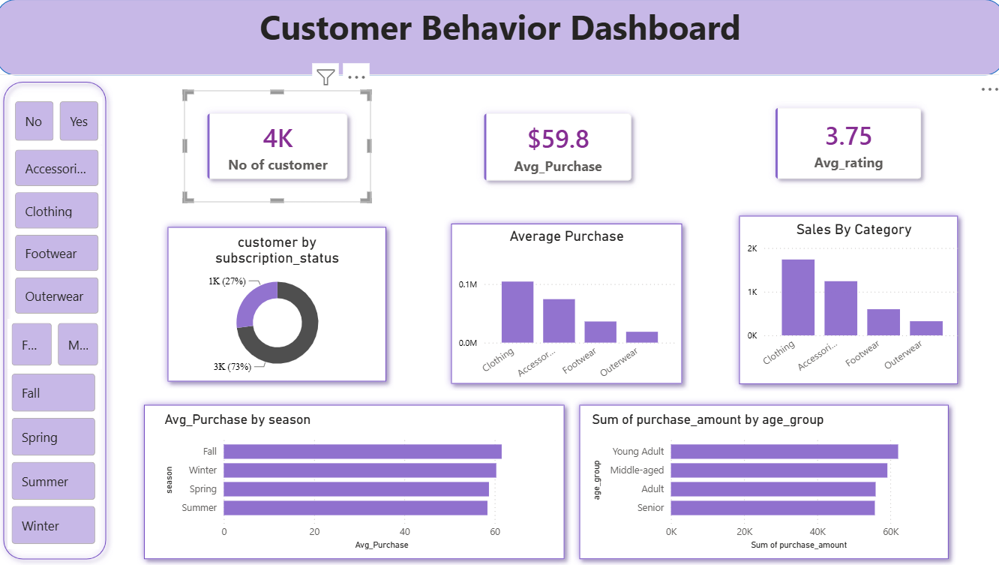

# 🛍️ Customer Shopping Behavior Analysis

A comprehensive Customer Shopping Behavior Analysis project designed to understand customer purchasing patterns, spending habits, product preferences, and sales-driving factors in a retail environment.

Built using **Python, Pandas, NumPy, Matplotlib, Seaborn, and MySQL**, this project transforms raw customer transaction data into meaningful business insights that can help retailers improve marketing strategies, customer retention, and inventory management.

---

## 🚀 Features

### 👥 Customer Demographic Analysis

Analyze customer age groups, gender distribution, and shopping behavior across different customer segments.

### 🛒 Product Category Analysis

Identify the most purchased product categories and understand customer preferences.

### 💰 Spending Pattern Analysis

Evaluate customer purchase amounts and identify high-spending customer groups.

### 🎁 Discount & Promotion Analysis

Measure the impact of discounts and promotional campaigns on purchasing decisions.

### 💳 Payment Method Analysis

Analyze customer payment preferences including Credit Card, Debit Card, PayPal, Cash, and other payment methods.

### 🍂 Seasonal Sales Analysis

Study purchasing behavior across Spring, Summer, Fall, and Winter seasons.

### ⭐ Customer Loyalty Analysis

Evaluate repeat purchase behavior using previous purchase history and subscription status.

### 🗄️ Database Integration

Store cleaned and transformed datasets in MySQL for future reporting and dashboard development.

---

## 📊 Dataset Overview

The dataset contains approximately **3,900 customer records** with information related to:

* Customer ID
* Age
* Gender
* Item Purchased
* Product Category
* Purchase Amount
* Location
* Season
* Review Rating
* Subscription Status
* Shipping Type
* Discount Applied
* Promo Code Usage
* Previous Purchases
* Payment Method
* Purchase Frequency

---

## 🧹 Data Preprocessing

### Data Cleaning Tasks

* Checked dataset structure and data types.
* Identified and handled missing values.
* Validated duplicate records.
* Standardized column names.
* Converted categorical purchase frequency values into numerical metrics.
* Created customer age segments using feature engineering.
* Performed category-wise median imputation for missing review ratings.

Example:

```python
df.isnull().sum()
df.duplicated().sum()
df.info()
```

---

## 📈 Exploratory Data Analysis

### Customer Analysis

* Gender Distribution Analysis
* Age Group Analysis
* Customer Segmentation

### Product Analysis

* Product Category Performance
* Most Purchased Products
* Category-wise Spending Trends

### Sales Analysis

* Purchase Amount Distribution
* Average Customer Spending
* Seasonal Sales Trends

### Marketing Analysis

* Discount Effectiveness
* Promo Code Usage Analysis
* Subscription Customer Analysis

### Payment Analysis

* Popular Payment Methods
* Customer Payment Preferences

---
## 📊 Power BI Dashboard

An interactive Power BI dashboard was developed using the cleaned customer shopping dataset to provide real-time business insights and visual analytics.

### Dashboard Features

* 📈 Total Sales Analysis
* 👥 Customer Demographics Overview
* 🛍️ Product Category Performance
* 💰 Average Purchase Amount Analysis
* 🎁 Discount & Promotion Impact
* 💳 Payment Method Distribution
* 🍂 Seasonal Sales Trends
* ⭐ Customer Rating Analysis
* 🔄 Customer Purchase Frequency Analysis
* 📍 Location-wise Sales Insights

### Key KPIs

* Total Customers
* Total Revenue
* Average Purchase Value
* Repeat Purchase Count
* Subscription Customer Count
* Top Selling Category
* Most Preferred Payment Method

### Interactive Filters

* Gender
* Age Group
* Product Category
* Season
* Location
* Subscription Status


## 🛠️ Tech Stack

* Python
* Pandas
* NumPy
* Matplotlib
* Seaborn
* MySQL
* SQLAlchemy
* Power BI
* Jupyter Notebook

---

## 📁 Project Structure

```text
customer-shopping-analysis/
│
├── data/
│   └── customer_shopping_behavior.csv
│
├── notebooks/
│   └── customer_analysis.ipynb
│
├── database/
│   └── mysql_connection.py
│
├── visualizations/
│   ├── category_analysis.png
│   ├── payment_analysis.png
│   └── seasonal_analysis.png
│
├── requirements.txt
└── README.md
```

---

## 🎯 Key Findings

* Clothing products generated the highest purchase volume.
* Customer spending patterns varied across product categories.
* Seasonal factors influenced purchasing behavior.
* Subscription customers demonstrated stronger engagement.
* Discounts and promotional offers impacted customer purchasing decisions.
* Certain payment methods were preferred more frequently than others.
* Repeat customers contributed significantly to overall sales activity.

---

## 📌 Business Impact

This analysis helps businesses:

* Understand customer purchasing behavior.
* Improve inventory planning and product stocking.
* Optimize promotional campaigns.
* Enhance customer retention strategies.
* Support data-driven decision making.
* Increase customer engagement and revenue growth.

---

## ▶️ How to Run

### 1️⃣ Install Dependencies

```bash
pip install -r requirements.txt
```

### 2️⃣ Load Dataset

```python
import pandas as pd

df = pd.read_csv("customer_shopping_behavior.csv")
```

### 3️⃣ Run Analysis Notebook

```bash
jupyter notebook
```

### 4️⃣ Execute Data Analysis Workflow

Run all notebook cells to perform:

* Data Cleaning
* Feature Engineering
* Exploratory Data Analysis
* Visualization
* MySQL Export

---

### 📷 Project Screenshots



## 👨‍💻 Author

**Chetan Malkhed**

Data Analyst | Python | SQL | Data Visualization Enthusiast

